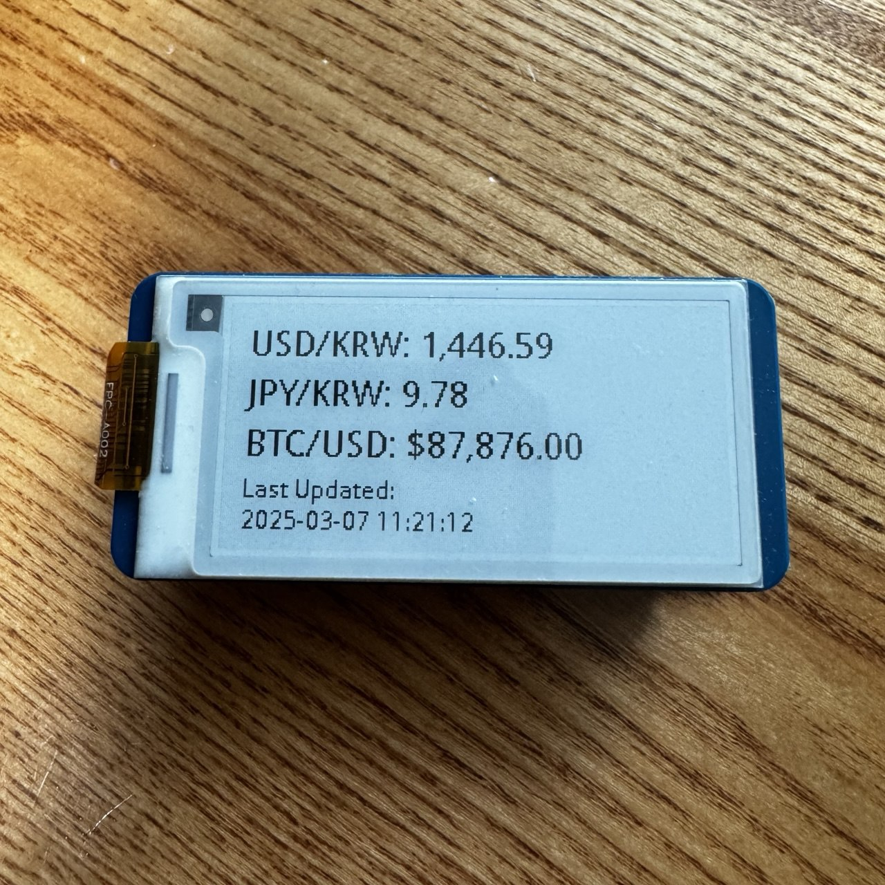

# E-ink Display with Raspberry pi zero2w

### introduction
본 프로젝트는 raspberry pi zero2w와 e-ink display를 연동하는 토이프로젝트 입니다.
1분마다 달러/원, 엔/원 환율, BTC 가격정보 갱신하여  e-ink display에 보여줍니다. 



### hardware
* Raspberry Pi Zero 2W
* Waveshare 2.13inch E-paper Display

### E-paper Display 설정
raspberry pi 에서 E-paper Display 설정하는것은 아래의 링크된 문서 참고하시기 바랍니다.
https://www.waveshare.com/wiki/2.13inch_e-Paper_HAT_Manual

### dp.sh
```
#!/bin/bash
/usr/bin/python3 /path/to/dp/app.py &
```

### crontab
@reboot 옵션은 부팅시 스크립트를 수행한다.
```
@reboot /path/to/dp.sh
```

### 개선점
- docker container로 빌드시 e-ink 자원사용 / 자원해제 에서 문제가 발생

### 참고
Dockerfile
```
# Base image: Use lightweight Debian-based Python image
FROM python:3.9-slim

# Set the working directory inside the container
WORKDIR /app

# Install system dependencies
RUN apt-get update && \
    apt-get install -y python3-pil python3-numpy build-essential && \
    rm -rf /var/lib/apt/lists/*  # Clean up to reduce image size

# Install Python libraries
RUN pip install --no-cache-dir -r requirements.txt

# Copy the application files into the container
COPY . .

# Set environment variables (optional, if needed)
ENV PYTHONUNBUFFERED=1

# Command to run the script
CMD ["python3", "app.py"]
```

build & run
```
docker build -t e-ink-display .
docker run -d --privileged --restart=always e-ink-display
```
